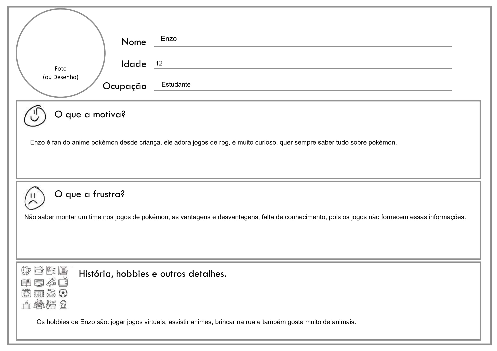
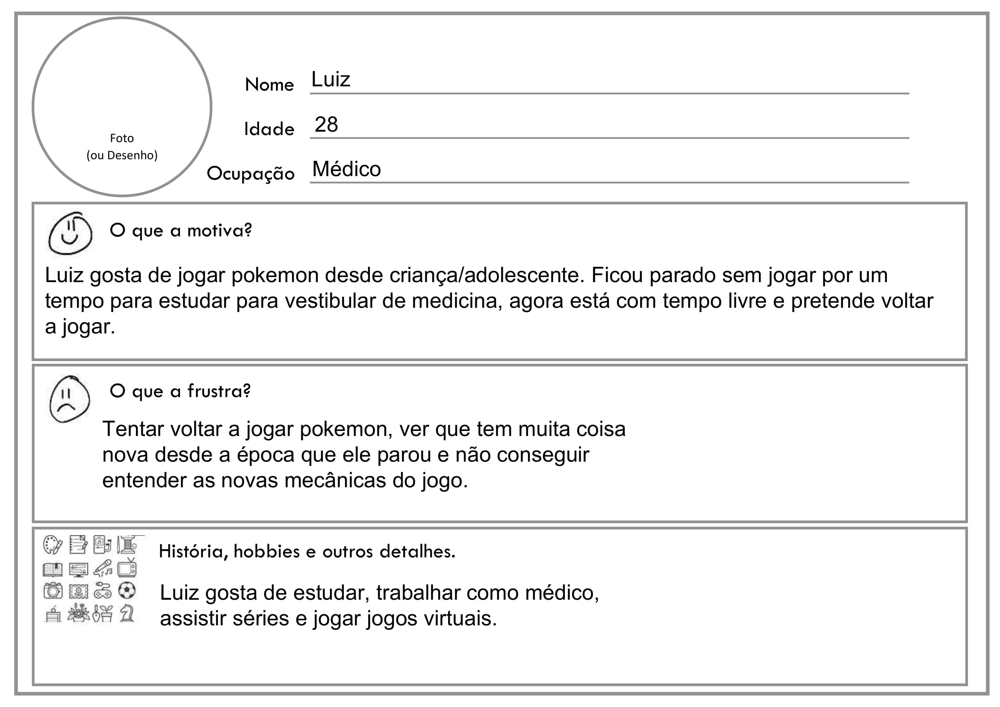
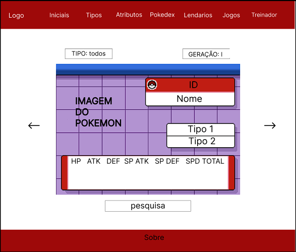

# Informações do Projeto
`TÍTULO DO PROJETO`  

......  POKEDEX  ......

`CURSO` 

...... SISTEMAS DE INFORMAÇÃO  ......

## Participantes

 Os membros do grupo são: 
- Gustavo Silvino
- Gustavo Ferreira
- Diogo dos Santos 
- Julia Fernandes Malaquias

# Estrutura do Documento

- [Informações do Projeto](#informações-do-projeto)
  - [Participantes](#participantes)
- [Estrutura do Documento](#estrutura-do-documento)
- [Introdução](#introdução)
  - [Problema](#problema)
  - [Objetivos](#objetivos)
  - [Público-Alvo](#público-alvo)
- [Especificações do Projeto](#especificações-do-projeto)
  - [Personas](#personas)
  - [Histórias de Usuários](#histórias-de-usuários)
  - [Requisitos](#requisitos)
- [Projeto da Solução](#projeto-da-solução)
  - [Wireframes](#wireframes)
  - [Mapa de navegação](#mapa-de-navegação)
- [Conclusões](#avaliação-da-aplicação)
  
# Introdução

## Problema

> As pokedex dos jogos oficiais da franquia pokemon,
> principalmente os jogos mais antigos não possuem todos
> os filtros de tipagem, filtro por região, apenas os 
> pokemons que você capturou dentro do jogo.
> Cada jogo da franquia tem uma pokedéx especifica

## Objetivos

 
Nosso objetivo é fazer um site de pokémon que
apresenta uma pokedéx geral, completa e com mais filtros. 
Além de um guia explicando algumas funcionalidades 
que os jogos não explicam direito, como um guia de iniciais e atributos,
os tipos dos pokemon e suas vantagens e desvantagens,
e um guia sobre os iniciais de cada região.

> **Link Útil**:
> - [Objetivo geral e objetivo específico: como fazer e quais verbos utilizar](https://blog.mettzer.com/diferenca-entre-objetivo-geral-e-objetivo-especifico/)

## Público-Alvo

Nosso Publico-alvo são pessoas que gostam, ou que apresentam algum interesse em Pokemon, independente da sua idade,
seja que pessoas novatas que querem começar a jogar algum jogo da franquia, de jogadores mais experientes, que precisam de algum tipo de site de consulta, 
e até mesmo os curiosos que querem saber de alguma informação sobre um pokemon

> 
> **Links Úteis**:
> - [Público-alvo: o que é, tipos, como definir seu público e exemplos](https://klickpages.com.br/blog/publico-alvo-o-que-e/)
> - [Qual a diferença entre público-alvo e persona?](https://rockcontent.com/blog/diferenca-publico-alvo-e-persona/)
 
# Especificações do Projeto

Uma API para a aplicação dos Pokemon.
Utilização de html, css e javascript aprendidas em sala de aula.

## Personas

>
> **Links Úteis**:
> - [Persona x Público-alvo](https://flammo.com.br/blog/persona-e-publico-alvo-qual-a-diferenca/)
> - [O que é persona?](https://resultadosdigitais.com.br/blog/persona-o-que-e/)
> - [Rock Content](https://rockcontent.com/blog/personas/)
> - [Hotmart](https://blog.hotmart.com/pt-br/como-criar-persona-negocio/)
> 
 

## Histórias de Usuários

Com base na análise das personas forma identificadas as seguintes histórias de usuários:

|EU COMO... `PERSONA`|      QUERO/PRECISO ... `FUNCIONALIDADE`         |               PARA ... `MOTIVO/VALOR`                 |
|--------------------|-------------------------------------------------|-------------------------------------------------------|
|Jogador Inexperiente| Saber sobre as vantagens de tipo do meu pokemon | Para encaixa-lo da melhor forma no time de 6 pokémon  |
|Jogador Experiente  | Saber os iniciais de algum jogo especifico      | Para saber qual inicial eu escolher no inicio do jogo |
|Jogador Curioso     | Entrar na parte das historias dos lendarios     | Para entender mais sobre o universo Pokémon           |
                                                                                    
>
> **Links Úteis**:
> - [Histórias de usuários com exemplos e template](https://www.atlassian.com/br/agile/project-management/user-stories)
> - [Como escrever boas histórias de usuário (User Stories)](https://medium.com/vertice/como-escrever-boas-users-stories-hist%C3%B3rias-de-usu%C3%A1rios-b29c75043fac)

## Requisitos

A tabela que segue apresenta os requisitos funcionais do projeto. 

### Requisitos Funcionais

|ID    | Descrição do Requisito                        | Prioridade |
|------|-----------------------------------------------|------------|
|RF-001| Permitir que o usuário pesquise os Pokemon    |   ALTA     |
|RF-005| Permitir o usuário colocar seu jogo e seu Pokemon favorito       |   ALTA     | 
|RF-002| permitir a filtragem de pokemon por geração   |   ALTA     | 
|RF-003| permitir a filtragem de pokemon por tipo      |   MÉDIA    |
|RF-005| Explicar como funciona os atributos nos jogos |   BAIXA    |
|RF-004| Mostrar um guia de iniciais de cada geração   |   MÉDIA    |
|RF-005| Mostrar os jogos da Franquia Pokemoon         |   BAIXA    |

> Com base nas Histórias de Usuário, enumere os requisitos da sua
> solução. Classifique esses requisitos em dois grupos:
>
> Lembre-se que cada requisito deve corresponder à uma e somente uma
> característica alvo da sua solução. Além disso, certifique-se de que
> todos os aspectos capturados nas Histórias de Usuário foram cobertos.

# Projeto da Solução

......  COLOQUE AQUI O SEU TEXTO ......
> Descreva brevemente quais tecnologias e/ou frameworks foram utilizados no projeto.

## Wireframes

> 
> **Links Úteis**:
> - [Ferramentas de Wireframes](https://rockcontent.com/blog/wireframes/)
> - [Figma](https://www.figma.com/)
> - [Adobe XD](https://www.adobe.com/br/products/xd.html#scroll)
> - [MarvelApp](https://marvelapp.com/developers/documentation/tutorials/)
> 
> **Exemplo**:
> 
> 

## Mapa de navegação

......  COLOQUE AQUI O SEU TEXTO OU DIAGRAMA DE NAVEGAÇÃO .......

> Inclua uma descrição textual ou um diagrama mostrando, sequencialmente, quais ações
> um usuário deve realizar para utilizar todas as características do seu sistema. 

> **Exemplo de Diagrama (opcional, pode ser em texto)**
> 

# Conclusões

......  COLOQUE AQUI O SEU TEXTO ......

> Finalize escrevendo um ou dois parágrafos para relembrar o objetivo do projeto, 
> o que foi possível alcançar e o que ficou para um trabalho futuro, e relembrando
> as principais dificuldes encontradas e como foi possível contorná-las. 

